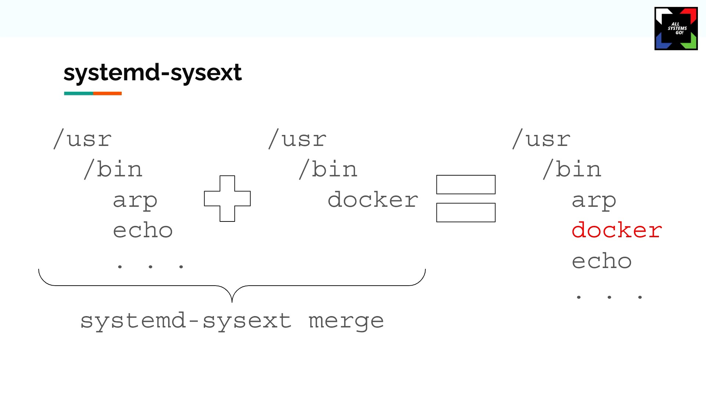

# Sysext-kitchen

## What is a "sysext"?

A [Systemd **sys**tem **ext**ension][sysext] is a raw image file which contains a
filesystem that can be layered on top of `/usr` and `/opt`.

This allows us to:

- **Extend read-only systems** (like Universal Blue) with capabilities like:
  - Development tools (vscode, docker, ).
- **Build a single extension**, for **multiple images** (per example, an extension can be compatible with `bluefin` and `bluefin-nvidia`).
- An alternative to RPM packages in order to apply changes over `/usr`.


_Credits to [Mathieu Tortuyaux and Timothée Ravier][allsysgo]_

## What is this repo for?

Serves as a tool to build system extensions (be in Github actions, or locally).
Confext (the equivalent for `/etc`) is supported as well.

> [!WARNING]
> Confext does not work currently until Systemd v257, wait until the [fix][selinuxfix] arrives.

## How to...

### ...build

```sh
just setup

IMAGE_REFERENCE="ghcr.io/ublue-os/bazzite"
EXTENSION_NAME="50-example"
just build $IMAGE_REFERENCE $EXTENSION_NAME
```

### ... try an extension...

To test an extension temporary (will be deactivated at reboot):

```sh
# If its a sysext
sudo mkdir -p /run/extensions
sudo ln -s $PWD/mkosi.output/50-example_sysext.raw /run/extensions
sudo systemctl restart systemd-sysext

# Otherwise, if its a confext
sudo mkdir -p /run/confexts
sudo ln -s $PWD/mkosi.output/50-example_confext.raw /run/extensions
sudo systemctl restart systemd-confext
```

If you want to enable it permanently:

```sh
# If its a sysext
sudo mkdir -p /var/lib/extensions
sudo cp $PWD/mkosi.output/50-example_sysext.raw /var/lib/extensions
sudo systemctl restart systemd-sysext

# Otherwise, if its a confext
sudo mkdir -p /var/lib/confexts
sudo cp $PWD/mkosi.output/50-example_confext.raw /var/lib/extensions
sudo systemctl restart systemd-confext
```

### ... add/remove packages

See `mkosi.conf.d/10-example.conf`.

### ... add repos

See `mkosi.conf.d/10-dx`.

## Resources

- [mkosi documentation][mkosi_doc]
  - [\[Content\] Section][mkosi_doc_content]:
    - Add packages with `Packages=`.
    - Add arbitrary files with `SkeletonTrees=` and `ExtraTrees=`.
  - [\[Build\] Section][mkosi_doc_build]:
    - `mkosi.sandbox/` and `SandboxTrees=` to add files to the builder (like `*.repo` files).
  - [Configuration Settings][mkosi_doc_configparse]

[sysext]: https://www.freedesktop.org/software/systemd/man/latest/systemd-sysext.html
[allsysgo]: https://youtu.be/xxNOHc4zY8c?si=l1as5dQwm5drln7j&t=284
[selinuxfix]: https://github.com/systemd/systemd/commit/bbec1c87d3bf8d14eeb1ee3b4df973a53cca2e58
[mkosi_doc]: https://github.com/systemd/mkosi/blob/main/mkosi/resources/man/mkosi.1.md
[mkosi_doc_content]: https://github.com/systemd/mkosi/blob/main/mkosi/resources/man/mkosi.1.md#content-section
[mkosi_doc_build]: https://github.com/systemd/mkosi/blob/main/mkosi/resources/man/mkosi.1.md#build-section
[mkosi_doc_configparse]: https://github.com/systemd/mkosi/blob/main/mkosi/resources/man/mkosi.1.md#configuration-settings
